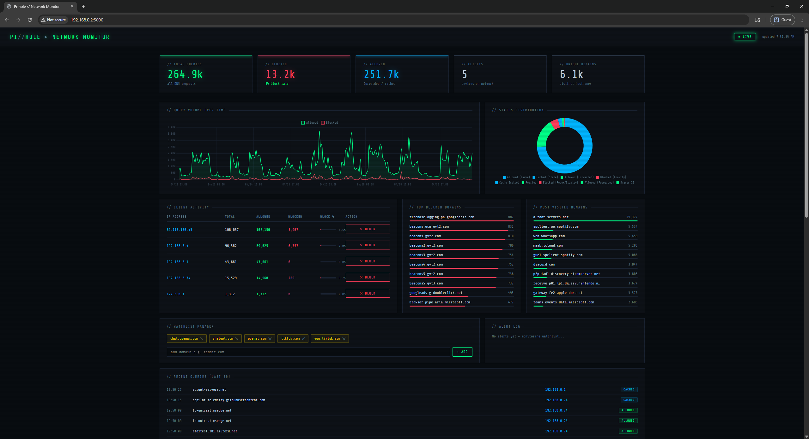
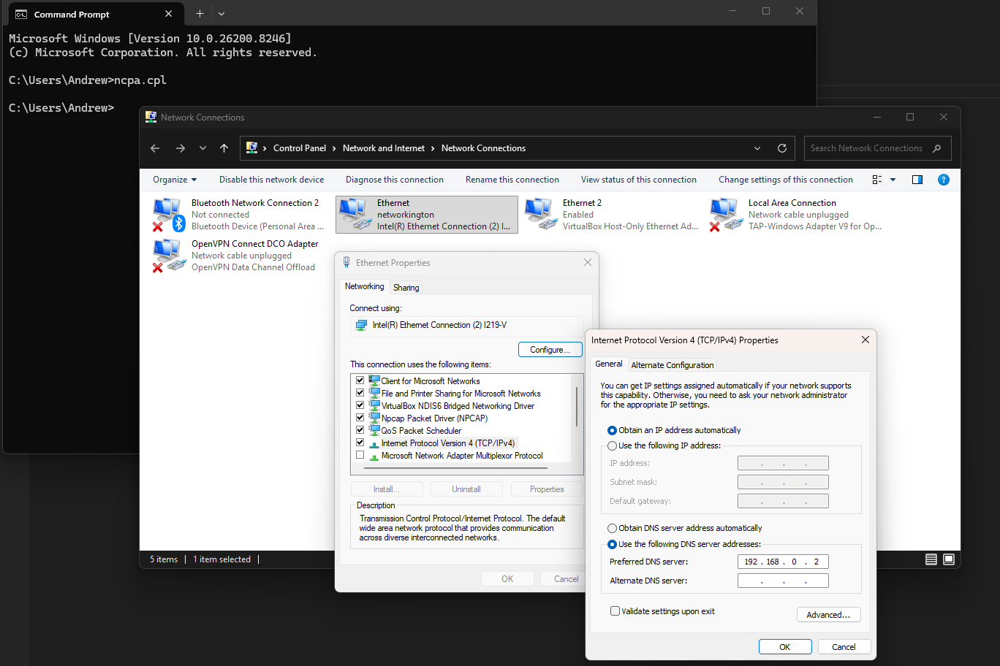
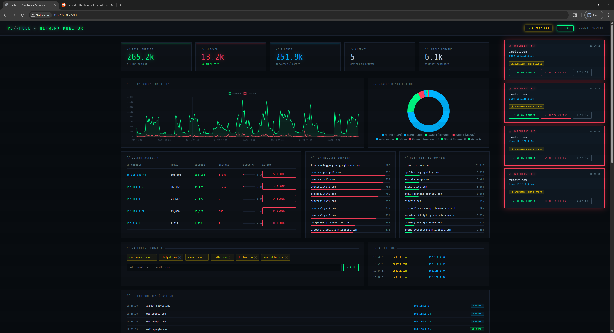
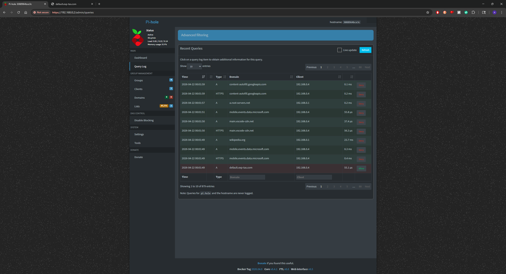
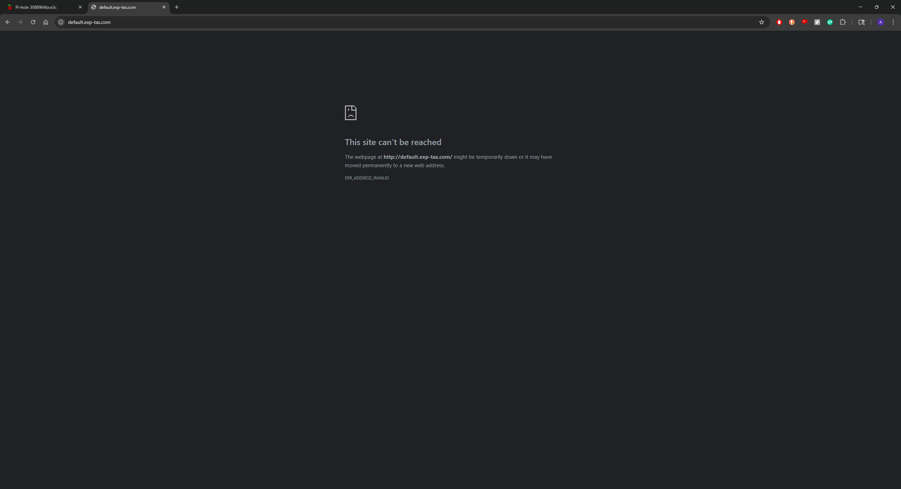
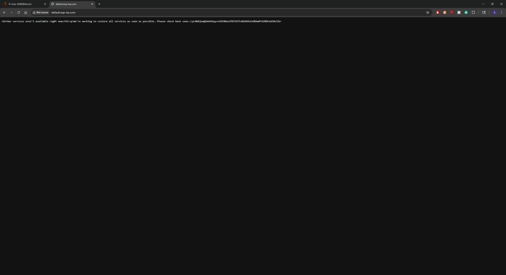
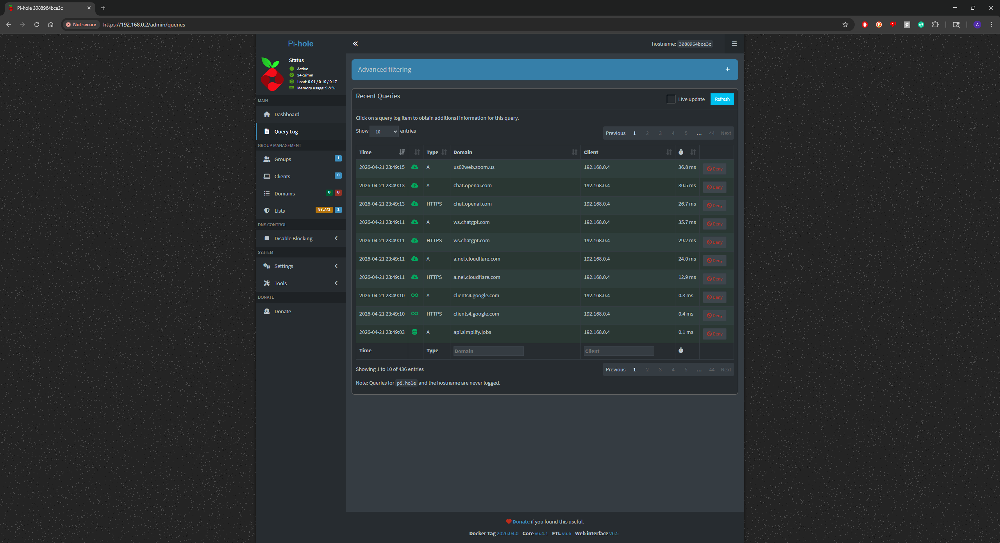
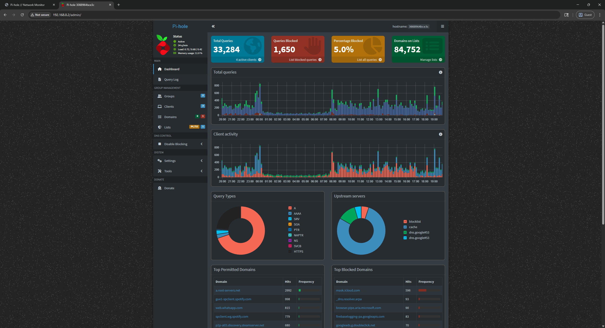
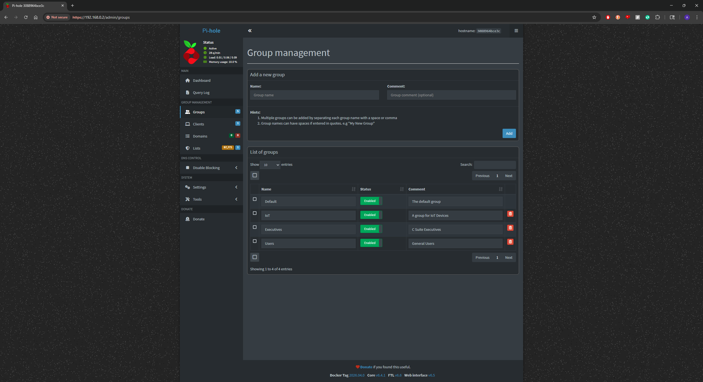

# Pi-hole as a Network-Level Incident Response Tool

### Live Dashboard with Real-Time DNS Monitoring and Client Enforcement



---

## 1. Project Overview

This project demonstrates how Pi-hole, a network-wide DNS sinkhole, can be used as a lightweight incident response tool to detect and contain suspicious network activity. Pi-hole runs inside a Docker container on a dedicated Raspberry Pi and is configured as the DNS resolver for all devices on the local network. Every DNS query made by every device is visible, logged, and subject to enforcement in real time.

The core deliverable is a custom Flask-based web dashboard (`App.py` + `index.html`) that connects directly to Pi-hole's SQLite database to provide a genuinely real-time view of network DNS activity — with no external dependencies, no third-party dashboards, and no polling delay. The dashboard includes watchlist-based alerting, per-client DNS enforcement via iptables, and a domain allowlist manager, all accessible from a browser on the local network.

---

## 2. Project Relevance

### Why Pi-hole Matters in Incident Response

Most security incidents do not start with a loud alarm. They start quietly — a device reaching out to a domain it should not be contacting. DNS is one of the most fundamental and most abused protocols in networking. Malware uses DNS to phone home to command-and-control (C2) servers. Phishing campaigns rely on DNS to redirect users. Data exfiltration can be tunneled through DNS. DNS-level visibility is therefore a foundational component of network security monitoring.

This project takes that principle and builds a practical, self-hosted tool on top of it. By sitting directly on the Raspberry Pi running Pi-hole and reading the same SQLite database that Pi-hole itself uses, the dashboard achieves sub-second update latency without requiring Kafka, a message broker, or any cloud infrastructure.

The dashboard directly supports two phases of the NIST SP 800-61 Incident Response lifecycle:

* **Detection and Analysis:** The query feed updates in real time as DNS traffic occurs. Watchlist hits fire instant toast notifications with action buttons. Per-client block rate and query volume are surfaced immediately.
* **Containment:** From the dashboard, an operator can block a client IP via iptables or add a domain to Pi-hole's allowlist without touching the command line — in one click, during an active incident.

---

## 3. Simulated Incident Walkthrough

The following demonstrates the full detection-to-containment cycle using a live test on the network.

### Setup: DNS Pointed at Pi-hole

The client machine is manually configured to use the Raspberry Pi (`192.168.0.2`) as its DNS server, routing all queries through Pi-hole and the dashboard.



### Step 1 — Detection: Watchlist Alert Fires

`reddit.com` was added to the watchlist to simulate monitoring a policy-violating or suspicious domain. The moment a device on the network queried it, the dashboard fired four real-time toast alerts — showing the domain, the client IP (`192.168.0.74`), and that the queries were allowed through (not yet blocked).



### Step 2 — Containment: Client Blocked via Dashboard

From the Client Activity table, the offending client (`192.168.0.74`) was blocked with one click. The dashboard inserted iptables `DOCKER-USER` DROP rules for port 53 (UDP + TCP). An `nslookup` run immediately after from the blocked machine confirms DNS resolution is failing — the Pi is receiving the query but dropping it.



### Step 3 — Verification: Site Unreachable

With DNS blocked, the client can no longer resolve any domains. Attempting to navigate to a website results in a browser-level failure — the domain cannot be reached because no IP address can be returned.



### Step 4 — Pi-hole Sinkhole Response

For domains on Pi-hole's blocklist, rather than a timeout the client receives Pi-hole's sinkhole response — a raw HTML error page served from the Pi itself, confirming the block is active and working at the DNS layer.



### Pi-hole Native Dashboard

The native Pi-hole interface shows the underlying query log and confirms all traffic is being captured and logged for analysis.





### Group Management

Pi-hole's group management was used to organize clients by category (IoT, Executives, General Users), allowing different blocklist policies to be applied per group — demonstrating policy-based containment rather than just blanket blocking.



---

## 4. System Architecture

### Physical Setup

```
All Network Devices
        │
        │  DNS queries (routed via DHCP)
        ▼
  Raspberry Pi 4
  ├── Docker: Pi-hole container (172.18.0.2 internal)
  │     ├── DNS resolver (port 53, exposed on host)
  │     └── pihole-FTL.db  (SQLite — all query history)
  │
  └── Python: Flask app (port 5000)
        ├── Watcher thread (polls pihole-FTL.db every 2s)
        ├── SSE: /api/stats/stream  → pushes stats every 2 seconds
        ├── SSE: /api/alerts/stream → pushes watchlist hits instantly
        └── REST: block / unblock / allowlist / watchlist APIs
```

### How Live Updates Work

The Flask app runs a background watcher thread that polls Pi-hole's SQLite database (`pihole-FTL.db`) every 2 seconds. A watermark (the highest query ID seen at startup) ensures only new queries are processed on each poll cycle. When new queries arrive:

1. Each domain is checked against the watchlist. If it matches, an alert is pushed immediately to all connected browsers via Server-Sent Events (SSE).
2. A debounce timer (2 seconds) controls how often the full stats snapshot is recomputed and pushed to the stats stream. This prevents hammering the database on high-traffic networks while keeping the dashboard visibly live.

The browser connects to two persistent SSE streams on load and never polls. Updates arrive as they happen.

```
pihole-FTL.db (new rows detected by watcher)
        │
        ├── Watchlist match? ──► push alert to /api/alerts/stream ──► toast notification
        │
        └── Debounce (2s) ──► recompute stats ──► push to /api/stats/stream ──► dashboard re-renders
```

### Why DOCKER-USER Instead of INPUT

Pi-hole runs inside Docker, which manages its own iptables rules and intercepts packets before the standard `INPUT` chain is evaluated. DNS packets from network clients arrive on `eth0`, are immediately forwarded by Docker into the Pi-hole container via a bridge network (`br-*`), and never pass through `INPUT` at the point where a block rule would stop them.

The `DOCKER-USER` chain is the one chain Docker explicitly leaves open for custom user rules. Rules inserted here are evaluated before Docker forwards the packet into any container, which is exactly the right interception point for blocking DNS access to Pi-hole.

```
Client DNS query arrives on eth0
        │
        ▼
  DOCKER-USER chain  ◄── block rules inserted here
        │
        │  (if not dropped)
        ▼
  Docker forwards to Pi-hole container (172.18.0.2:53)
```

---

## 5. Tools and Stack

| Component | Tool | Purpose |
| --- | --- | --- |
| DNS Sinkhole | Pi-hole (Docker) | DNS resolver, blocklist enforcement, query logging |
| Container Runtime | Docker | Isolates Pi-hole on the Raspberry Pi |
| Backend | Python 3 / Flask | Serves dashboard, reads DB, manages SSE streams |
| Database | SQLite (`pihole-FTL.db`) | All historical DNS query data |
| Frontend | Vanilla HTML/CSS/JS + Chart.js | Dashboard UI, no framework dependencies |
| Network Enforcement | iptables (`DOCKER-USER` chain) | Per-client DNS blocking via port 53 DROP rules |
| DNS Allowlisting | `pihole -w` CLI | Domain allowlisting via subprocess call |
| Persistence | `blocked_clients.json` | Blocked IPs persisted to disk, re-applied on restart |
| Process Management | systemd | Auto-starts dashboard on boot, restarts on crash |
| Remote Dev | VS Code Remote SSH | Development directly on the Raspberry Pi |

---

## 6. Dashboard Features

### Real-Time Stats (event-driven, not polled)

* Total queries, blocked count, allowed count, block rate
* Unique clients and unique domains seen
* Block rate color-coded: green (normal), yellow (elevated >15%), red (high >30%)
* "Updated" timestamp reflects the moment of the last push from the server

### Query Volume Timeline

* Hourly chart of allowed vs. blocked queries
* Rendered with Chart.js, updates in-place without flicker on each push

### Status Distribution

* Doughnut chart breaking down query outcomes by Pi-hole status code
* Color-coded: blocked (red), cached (blue), allowed (green)

### Client Activity Table

* Per-device breakdown: total, allowed, blocked, block percentage with mini bar
* **Block** button: inserts iptables `DOCKER-USER` DROP rules for port 53 (UDP + TCP) for that client IP
* **Unblock** button: removes those rules
* Blocked clients marked with a red indicator that persists across page refreshes
* Block state is loaded from the server on page load — refreshing the browser never resets the UI incorrectly
* Inline error display shows the exact iptables error if a block operation fails

### Top Blocked / Top Allowed Domains

* Animated bar lists showing the 10 most blocked and 10 most queried allowed domains
* Bar widths update smoothly on each stats push

### Recent Queries Feed

* Last 50 DNS queries with timestamp, domain, client IP, and status badge
* Blocked rows highlighted in red
* New queries flash green on arrival so activity is visible at a glance

### Watchlist Manager

* Editable list of domains to monitor (e.g. `tiktok.com`, `chatgpt.com`)
* Add or remove entries from the browser; changes take effect immediately in the watcher thread
* Watchlist persists in memory for the session

### Real-Time Alert Toasts

* When any device queries a watchlisted domain, a toast notification fires instantly
* Toast shows: domain, client IP, timestamp, whether it was blocked or allowed through
* One-click actions from the toast: **Allow Domain** (adds to Pi-hole allowlist via `pihole -w`) or **Block Client** (iptables DROP)
* Alerts auto-dismiss after 30 seconds; logged to the Alert Log panel

### Alert Log

* Persistent in-session log of all watchlist hits
* Shows action taken (BLOCKED / ALLOWED / pending) color-coded per outcome

---

## 7. Running the Dashboard

### Prerequisites

```
pip3 install flask --break-system-packages
```

### Option A — Run manually (useful for testing)

```
sudo python3 App.py
```

`sudo` is required for iptables access. The watcher thread starts automatically.

### Option B — Auto-start with systemd (recommended for permanent deployment)

Create the service file:

```
sudo nano /etc/systemd/system/pihole-dashboard.service
```

Paste the following, adjusting the path to match where `App.py` lives:

```
[Unit]
Description=Pi-hole Dashboard
After=network.target docker.service
Requires=docker.service

[Service]
Type=simple
User=root
WorkingDirectory=/home/am1
ExecStart=/usr/bin/python3 /home/am1/App.py
Restart=always
RestartSec=5

[Install]
WantedBy=multi-user.target
```

Enable and start:

```
sudo systemctl daemon-reload
sudo systemctl enable pihole-dashboard
sudo systemctl start pihole-dashboard
```

Check status:

```
sudo systemctl status pihole-dashboard
```

Useful management commands:

```
sudo systemctl stop pihole-dashboard       # stop
sudo systemctl restart pihole-dashboard    # restart
sudo journalctl -u pihole-dashboard -f     # live logs
```

### Access

Open a browser on any device on the network:

```
http://192.168.0.2:5000
```

---

## 8. API Reference

| Method | Endpoint | Description |
| --- | --- | --- |
| GET | `/api/stats` | One-shot full stats snapshot (JSON) |
| GET | `/api/stats/stream` | SSE stream — pushes stats every 2 seconds |
| GET | `/api/alerts/stream` | SSE stream — pushes watchlist hits instantly |
| GET | `/api/blocked-clients` | Returns current list of blocked IPs from server |
| POST | `/api/action/allow` | Add domain to Pi-hole allowlist via `pihole -w` |
| POST | `/api/action/block` | Block client DNS via iptables `DOCKER-USER` DROP |
| POST | `/api/action/unblock` | Remove iptables block for client IP |
| POST | `/api/watchlist/add` | Add domain to watchlist |
| POST | `/api/watchlist/remove` | Remove domain from watchlist |

---

## 9. Key Design Decisions

**Event-driven over polling.** The watcher thread drives all updates. The browser never polls — it holds open two SSE connections and reacts to pushes. This eliminates the artificial delay of an interval timer and makes the dashboard feel genuinely live.

**SQLite polling over log tailing.** The watcher queries `pihole-FTL.db` directly every 2 seconds using a high-watermark on the query ID column, rather than tailing the log file. This is more robust across Pi-hole versions (v5 and v6 both use the same DB schema) and avoids brittle log parsing.

**Debouncing the DB reads.** The SQLite database is read at most once every 2 seconds regardless of query volume. On a quiet network this means near-instant updates; on a busy network it prevents excessive load on the Pi without any visible lag to the user.

**`DOCKER-USER` for iptables enforcement.** Because Pi-hole runs inside Docker, the standard `INPUT` chain is bypassed — Docker intercepts packets and forwards them into the container before `INPUT` is evaluated. The `DOCKER-USER` chain is Docker's designated hook for user-defined rules and is evaluated before any container forwarding occurs. Block rules target port 53 specifically (UDP and TCP) rather than all traffic from the client IP.

**Persistent block state.** Blocked client IPs are written to `blocked_clients.json` on every change. On startup the app reads this file and re-applies all iptables rules, so blocks survive a Flask restart or a reboot. The `/api/blocked-clients` endpoint lets the frontend load real state on page load rather than starting blank.

**IP validation before shell execution.** The block and unblock endpoints validate the supplied IP using Python's `ipaddress` module before passing it to any subprocess call, preventing malformed input from reaching the shell.

**`stream_with_context` for SSE.** Flask's default response buffering delays SSE delivery. Wrapping generators in `stream_with_context` ensures each event is flushed to the client immediately rather than accumulating in a buffer.

**No frontend framework.** The dashboard is a single `index.html` file with no build step, no npm, no bundler. Chart.js is loaded from a CDN. This keeps deployment as simple as copying two files to the Pi.

---

## 10. Limitations and Lessons Learned

**Watchlist persistence.** The watchlist is held in memory and lost when the Flask app restarts. In a real incident, losing monitored domains mid-response is an unacceptable gap. A production version should persist the watchlist to disk alongside `blocked_clients.json`.

**No authentication.** Any device on the local network can access the dashboard, block clients, or modify the watchlist. For a home lab this is acceptable, but in a production deployment this would require at minimum a token-based auth layer on all API endpoints. This is a known shortcoming of the current implementation.

**Encrypted DNS (DoH/DoT).** Devices or apps configured to use DNS-over-HTTPS bypass Pi-hole entirely and will not appear in the dashboard. This is a real and significant gap in any DNS-based monitoring approach — a determined attacker or a modern browser in DoH mode is invisible to this tool.

**Blocklist freshness.** Pi-hole only blocks what is on its lists. Newly registered domains or C2 servers not yet in any blocklist will pass through. Behavioral detection via the watchlist and per-client volume anomalies partially compensates for this, but is not a substitute for threat intelligence feeds.

**iptables vs. nftables.** Newer Linux kernels on Raspberry Pi OS use nftables as the backend. The iptables commands used here work via the compatibility layer, but a future version should call nftables directly.

**IPv6.** The current iptables rules only cover IPv4. Clients communicating with Pi-hole over IPv6 require equivalent `ip6tables` rules in the `DOCKER-USER` chain to be blocked effectively.

**Potential extensions:**

* Persistent watchlist storage (JSON or SQLite)
* Token-based authentication on all API endpoints
* Email or webhook alerts for watchlist hits
* Per-client query history drill-down view
* Automatic blocklist updates from threat intelligence feeds
* IPv6 blocking via `ip6tables`
* Log forwarding to a SIEM (Splunk, ELK) for long-term retention

---

## 11. Resources

* Pi-hole Documentation: <https://docs.pi-hole.net/>
* Pi-hole Docker Setup: <https://github.com/pi-hole/docker-pi-hole>
* Flask Documentation: <https://flask.palletsprojects.com/>
* Server-Sent Events (MDN): <https://developer.mozilla.org/en-US/docs/Web/API/Server-sent_events>
* Chart.js Documentation: <https://www.chartjs.org/docs/>
* iptables man page: <https://linux.die.net/man/8/iptables>
* NIST SP 800-61 (Incident Handling Guide): <https://nvlpubs.nist.gov/nistpubs/SpecialPublications/NIST.SP.800-61r2.pdf>
* DNS Sinkholes Explained: <https://www.sans.org/white-papers/33523/>
